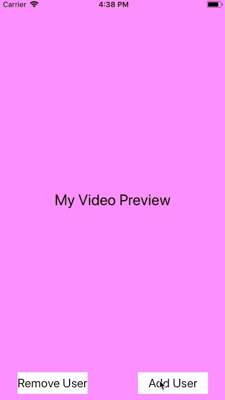

# MultiVideoCallSim
A simulation showing how you could handle multiple video callers on a single screen.

The app simulates a video call using basic `UILabel`s with differing `backgroundColor`s and `text`. When a new user is added to the call, the `UIStackView`s are rearranged to nicely fit the added user. This also works when a user is removed from the call.

The app does not simulate users leaving out of the order they were added in, but that case _should_ be handled gracefully by the code as written. User videos would just shuffle around to fill the gaps in the expected order.

### Potential additions:
- [ ] Touching a user's view makes that specific user leave (simulating user's leaving out of order)
- [ ] Animating the stack view changes
- [ ] Adding stock photos instead of solid color `UILabel`'s to represent user videos
- [ ] Connect to an actual video service (e.g. Twilio) to show off the capability

**Note**: the idea for this simulation is expanding upon an app that I worked on at a startup that went under.
